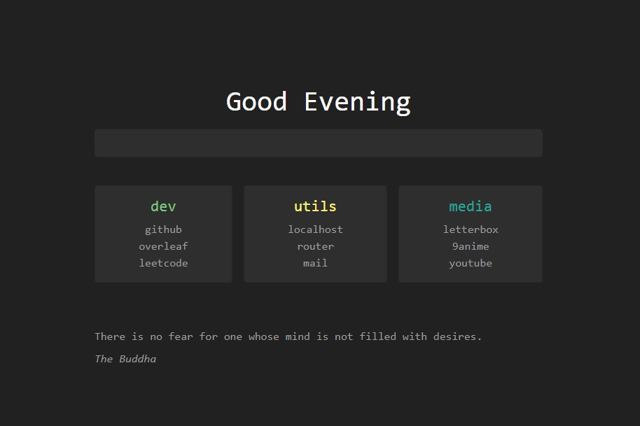

<div align="center">
    <h1> Just Another Clean Startpage </h1>
    <i> Because I had nothing better to do </i>
</div>

---



## "Features"

### Dynamic greeting message

Using the following map:

- **[1 - 5.59]**: Take some sleep
- **[6 - 8.59]**: You're up early
- **[9 - 11.59]**: Have a good day ahead
- **[12 - 16.59]**: Good Afternoon
- **[17 - 19.59]**: Good Evening
- **[20 - 23.59]**: It's time to wrap up for the day

### Dynamic card generation

You can define each card under [`cards.json`](./cards.json) following the schema:

```json
[
    {
        "title": ...,
        "color": ...,
        "links": [
            {
                "display": ...,
                "link": ...,
                "shortcut": ..., // Optional
            },
            ...
        ]
    },
    ...
]
```

This json will then generate all the cards under the searchbar, as shown in the preview.

### Dynamic short search

As stated in [Dynamic card generation](#dynamic-card-generation), there's a shortcut field for each link under the cards and under the standalonefile [`shortcuts.json`](./shortcuts.json). You can use that shortcut instead of the full sentence to search for it under the searchbar. For example, imagine the following `shortcuts.json`:

```json
{
    "yt": "https://www.youtube.com"
}
```

I could search for `yt` in the searchbar and it would go to `https://www.youtube.com`. All shortcuts will be merged into one structure, so take into account the possible merge conflicts and understand that all the shortucts under [`shortcuts.json`](./shortcuts.json) will take preference under the ones on [`cards.json`](./cards.json)

### Static quotes

> _Why not use an API????_

Who wants more dependencies in a startpage. Feel free to modify the code to change the quote behaviour, that was one of the main interests of this project: To be as maleable and clear as possible.

## Inspiration

- [deepjyoti30](https://github.com/deepjyoti30)'s startpage was the main design inspiration
